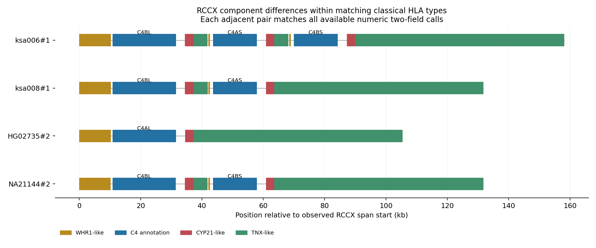

# Expanded HLA analysis — intermediate results

**The full five-part analysis is not complete.** This extends the pilot; it does not establish novel alleles, regulatory effects or disease associations.

## Frozen reference and sequence audit

IPD-IMGT/HLA 3.65.0 (14 July 2026), Git commit `5b915f27f7f620361cf83cb626eeac8a03c0247c`. Source URLs and SHA-256 hashes are in `source/imgt/manifest.json`. CDS and gene sequences are extracted from the supplied GTF coordinates, not independently reannotated. Stops are included once; negative-strand intervals are handled in gene orientation.

| Locus | Annotated entries | CDS passes completeness checks | Exact genomic match | Exact CDS match |
|---|---:|---:|---:|---:|
| HLA-A | 753 | 745 | 721 | 738 |
| HLA-B | 754 | 754 | 505 | 753 |
| HLA-C | 754 | 754 | 645 | 751 |
| HLA-DRB1 | 754 | 754 | 206 | 724 |
| HLA-DQA1 | 753 | 753 | 597 | 751 |
| HLA-DQB1 | 751 | 748 | 722 | 747 |
| HLA-DPA1 | 754 | 751 | 398 | 750 |
| HLA-DPB1 | 754 | 754 | 661 | 751 |
| HLA-DRB3 | 306 | 305 | 50 | 305 |
| HLA-DRB4 | 202 | 186 | 44 | 196 |
| HLA-DRB5 | 135 | 133 | 15 | 129 |

Completeness checks are conservative eligibility rules, not proof of functional expression. Known null/abnormal alleles can fail them. Genomic nonmatches may reflect reference coverage or boundary differences. HG02717 haplotype 1 DQB1, previously labelled `02:new`, matches current DQB1*02:180 CDS exactly. apr003 haplotype 1 HLA-A has a partial-CDS annotation and cannot be treated as a complete novel allele.

There are 47 distinct database-absent protein signatures in 50 complete-CDS entries. All remain unresolved; none has yet been validated as a new allele. `coding_candidates.tsv` provides stable sequence-based IDs, nearest reference protein edit distances, source donors and quality flags.

## Fixed-panel typing benchmark

One assembly source per reconciled donor is retained; target donor and known/provisional family groups are excluded from reference labels. Bundle construction used the entire panel, including queries: results are fixed-panel/transductive. They do not measure performance on a graph built without the target population. Pedigree coverage remains incomplete.

Labels are unambiguous numeric two-field assignments from exact current CDS matches, conditional on complete, single-copy annotations. This intentionally excludes unresolved candidates and known abnormal-CDS cases. Expression suffixes are not an endpoint. All methods use the same eligible queries and references per locus. No-call and ambiguity count against the all-evaluated denominator. Tied nearest neighbours with different labels remain ambiguous.

Gene sequence, sampled coding sequence and flanks use canonical 31-mers retained by a fixed 1/32 hash rule. An additional coding baseline uses every canonical 31-mer. Bundle features are binary presence, not full path order or sequence. Gene content uses observed annotation copy counts and is not independently validated copy number. DRA–DMA regional bundles for DPA1/DPB1 test regional haplotype correlation, not direct coverage of those genes.

| Locus | N | Gene sequence | All coding 31-mers | Gene bundles | DRA–DMA bundles | Gene content |
|---|---:|---:|---:|---:|---:|---:|
| HLA-A | 726 | 75.2% | 98.2% | 21.9% | — | 6.6% |
| HLA-B | 741 | 92.4% | 96.4% | 33.5% | — | 1.5% |
| HLA-C | 739 | 94.9% | 99.1% | 34.8% | — | 2.0% |
| HLA-DPA1 | 735 | 99.7% | 99.9% | 42.2% | 31.2% | 5.2% |
| HLA-DPB1 | 738 | 85.9% | 97.8% | 17.2% | 13.4% | 0.9% |
| HLA-DQA1 | 738 | 98.1% | 99.6% | 84.4% | 94.6% | 7.6% |
| HLA-DQB1 | 733 | 99.6% | 99.6% | 64.5% | 93.9% | 7.4% |
| HLA-DRB1 | 712 | 96.1% | 98.9% | 42.4% | 83.7% | 6.2% |
| HLA-DRB3 | 302 | 94.4% | 99.7% | 45.4% | 96.4% | 8.6% |
| HLA-DRB4 | 180 | 99.4% | 99.4% | 47.8% | 97.8% | 42.2% |
| HLA-DRB5 | 124 | 99.2% | 99.2% | 0.0% | 98.4% | 19.4% |

These percentages are family-excluded agreement with sequence-derived labels, not clinical typing accuracy. `typing_metrics.tsv` also contains cohort exclusion, rare/unseen reference-allele strata, call rates and training-majority controls. Cohort exclusion uses recorded subgroups, not strict leave-study-out validation. Family-cluster bootstrap intervals and paired differences are in `typing_uncertainty.tsv`; these condition on fixed predictions and do not capture graph-reconstruction uncertainty or unknown relatives. A coarse binary bundle representation can tie across many alleles; low unambiguous agreement does not prove all graph-based approaches fail.

## Independent experimental comparison

The older five-locus Sanger table supplies unordered diploid calls and ambiguity sets. `experimental_genotypes.tsv` keeps those sets and reports all evaluated donors, including method no-calls. Current exact-CDS assignments disagree at numeric two-field resolution in 14 donor/locus comparisons.

Current frozen G-group definitions make 10 of those disagreements compatible with antigen-recognition-exon resolution; 4 remain unresolved at that level. Expanding historical partial allele names gives possible compatibility, not proof of the original assay's exact sequence. `experimental_discordances.tsv` preserves the evidence; read/alternative-assembly inspection is still required. [G-group construction](https://hla.alleles.org/pages/p%26g_groups/g_groups/) can also infer unsequenced regions, further limiting this compatibility check.

## Information within matching types

Among 742 retained haplotypes, 654 have usable current labels at all eight core loci and resolved annotated DRB3/4/5 copies. Unannotated DRB3/4/5 states remain provisional, not confirmed absence. The screen records 1828 feature contrasts within matching DRB1–DQA1–DQB1 labels and 101 within all available classical two-field labels. These are correlated contrasts, not counts of independent variants or discoveries.

The contrasts include gene/CDS/protein/flank sequence hashes, annotation counts/order and C4 annotation order. Full RCCX module structure has not been reconstructed. Sequence-length/boundary effects and clipping still require candidate-level review. Flank differences do not establish regulatory function.

## Reproduction and outstanding work

Run from the repository root:

```sh
python3 hla-analysis/sequence_catalogue.py
python3 hla-analysis/coding_candidates.py
OPENBLAS_NUM_THREADS=2 OMP_NUM_THREADS=2 python3 hla-analysis/benchmark.py
python3 hla-analysis/within_type_catalogue.py
python3 hla-analysis/experimental_discordances.py
OPENBLAS_NUM_THREADS=2 python3 hla-analysis/benchmark_uncertainty.py
python3 hla-analysis/check_results.py
python3 hla-analysis/write_report.py
```

Outstanding: complete panel/metadata and endpoint eligibility audit; investigate four unresolved experimental discordances; inspect and validate leading coding/structural/flanking candidates; reconstruct or explicitly delimit RCCX coverage; establish any incremental benefit of combinations over sequence alone; final requirement-by-requirement audit. See `GOAL.md` and `UKB_VALIDATION_PLAN.md`. UKB execution remains post-hackathon.

## Targeted validation and incremental bundle test

The exploratory tie-breaking rule in `bundle_increment.py` uses bundle labels only to narrow ambiguous all-CDS-kmer calls. It rescued zero correct calls in either exclusion scheme; it introduced one false unambiguous call with gene bundles in each scheme, and one/two with regional bundles in family/cohort exclusion. This rule does not establish added typing value; it does not rule out other graph representations.

Targeted read checks and within-donor MHC probe specificity support the distinguishing SNPs of three database-absent protein candidates (NA18620 HLA-C, HG02976 DRB1, NA19159 DRB1). They are plausible candidates, not confirmed novel alleles. See [read-validation evidence](results/read_validation.md) and `candidate_evidence_ranking.tsv`. Three other candidate donors have no local CRAM. Whole-allele phase, expression and exhaustive literature novelty remain unresolved.

The NA18943 A/DRB1 discrepancies have both cross-source assembly and local read support for the assembly bases; NA19007 A has local read support. NA18608 DRB1 remains unresolved because several probes are nonunique. Historical assay error is not established by these observations.

Logsdon et al. 2025 is a direct precedent for PGR-TK MHC analysis and RCCX gene/pseudogene arrangements (doi:10.1038/s41586-025-09140-6). Full text and supplementary tables are archived. Its C4 annotations match the unordered diploid C4 signatures in all four overlapping evaluable donors; this does not independently reconstruct full RCCX structure in our panel.

Additional reproduction commands: `python3 hla-analysis/bundle_increment.py`, `python3 hla-analysis/prepare_read_markers.py`, `python3 hla-analysis/independent_assembly_checks.py`, and `python3 hla-analysis/summarize_read_support.py`. Read counts use `read_markers.sbatch` on DDBJ, followed by `marker_specificity.py`; raw count and specificity outputs are archived locally. These commands require the archived source tables and remote MHC reads/assemblies respectively.

## Structural catalogue and final panel eligibility checkpoint

The separate [C4/RCCX screen](results/rccx_report.md) now covers all 754 entries. A conservative 591-entry subset passes source, contiguity, gap and component-count checks. Two matched-classical-HLA backgrounds show RCCX differences: ksa006#1 versus ksa008#1 has three versus two components, and HG02735#2 versus NA21144#2 has one versus two. Full functional paralog/fusion typing remains unresolved; these are known structural classes, not new discoveries.



Strict source QC retains 34 flanking-sequence contrasts within matching all-classical two-field calls; all retained flanks have 2 kb on each side and no ambiguous bases. Fourteen genomic contrasts are already exact sequences in the current allele database, and 24 genomic contrasts remain unresolved. Six correlated content/order/C4 contrasts describe the two RCCX backgrounds above. These feature contrasts are not independent variants. Evidence is in `within_type_evidence.tsv`.

The published HGSVC3 genomic allele archive supplies an additional direct sequence check: none of the 47 protein candidates has an exact ordered-CDS-block match there. This negative search does not establish novelty, especially for synonymous differences or publications not represented by that archive. The archive contains 1,005 exact genomic matches to known panel sequences, providing positive extraction/source controls.

Full-panel eligibility is explicit in `frozen_panel.tsv` and `endpoint_eligibility.tsv`: 754 input entries, 742 retained haplotypes and 371 name-reconciled donors. Public pedigree records cover 228 retained donors; relationships outside those records remain unverified. Gene absence, incomplete CDS, unresolved current labels and feature exclusions are recorded separately.

Reproduce this checkpoint with `freeze_panel.py`, `assess_contrasts.py`, `rccx_catalogue.py`, `rccx_report.py` and `published_sequence_check.py` in `hla-analysis/`. RCCX alignments and assembled-span QC are archived from DDBJ jobs 20605384 and 20605526. Final integration, selected structural/flanking validation and requirement-by-requirement completion review remain open.
